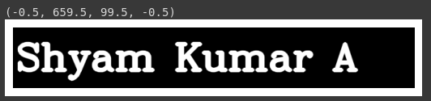
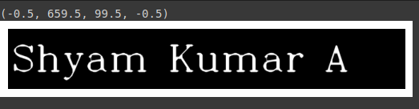
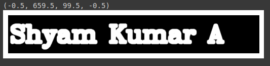

# Implementation-of-Erosion-and-Dilation
## Aim
To implement Erosion and Dilation using Python and OpenCV.
## Software Required
1. Anaconda - Python 3.7
2. OpenCV
## Algorithm:
### Step 1:
Import the necessary packages to do Erosion and Dilution.
<br>

### Step 2:
Create the text image of our name using putText from cv2 package.
<br>

### Step 3:
Create the required structural element.
<br>

### Step 4:
Apply Erode and Dilution for our NameImage.
<br>

### Step 5:
Display the output images.
<br>

### Step 6:
End the program.
 
## Program:
```
Name : Shyam Kumar A
Reg No : 212221230098
```
``` Python
# Import the necessary packages
import cv2
import numpy as np
import matplotlib.pyplot as plt

# Create the Text using cv2.putText
img1=np.zeros((100,660),dtype='uint8')
font = cv2.FONT_HERSHEY_SIMPLEX = 3
cv2.putText(img1,'Shyam Kumar A',(5,70),font,2,(255),5,cv2.LINE_AA)
plt.imshow(img1,'gray')
plt.axis('off')

# Create the structuring element
kernel=np.ones((5,5),np.uint8)

# Erode the image
image_erode1=cv2.erode(img1,kernel)
plt.imshow(image_erode1,'gray')
plt.axis('off')

# Dilate the image
image_dilatel=cv2.dilate(img1,kernel)
plt.imshow(image_dilatel,'gray')
plt.axis('off')
```
## Output:

### Display the input Image
<br>


<br>
### Display the Eroded Image
<br>


<br>
### Display the Dilated Image
<br>


<br>
## Result
Thus the generated text image is eroded and dilated using python and OpenCV.

